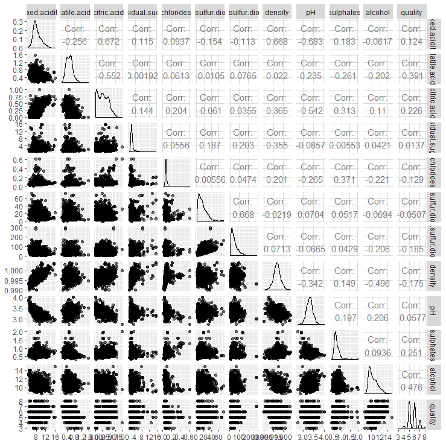

---
output:
  word_document: default
  html_document: default
---
Red Wine Exploration by Marvin Lüthe
========================================================

```{r include = FALSE, echo=FALSE, message=FALSE, warning=FALSE, eval=TRUE, knitr}
knitr::opts_chunk$set(echo=FALSE,warning=FALSE,message=FALSE)
knitr::opts_chunk$set(fig.width=9,fig.height=5,fig.path='Figs/',
                      fig.align='center',tidy=TRUE,
                      echo=FALSE,warning=FALSE,message=FALSE)
```

```{r include = FALSE, echo=FALSE, message=FALSE, warning=FALSE, eval=FALSE, packages}
knitr::opts_chunk$set(echo=FALSE,warning=FALSE,message=FALSE)
knitr::opts_chunk$set(fig.width=9,fig.height=5,fig.path='Figs/',
                      fig.align='center',tidy=TRUE,
                      echo=FALSE,warning=FALSE,message=FALSE)

# Load all of the packages that you end up using in your analysis in this code
# chunk.

# Notice that the parameter "echo" was set to FALSE for this code chunk. This
# prevents the code from displaying in the knitted HTML output. You should set
# echo=FALSE for all code chunks in your file, unless it makes sense for your
# report to show the code that generated a particular plot.

# The other parameters for "message" and "warning" should also be set to FALSE
# for other code chunks once you have verified that each plot comes out as you
# want it to. This will clean up the flow of your report.

install.packages('ggplot2', repos = 'http://cran.us.r-project.org')
install.packages('gridExtra', repos = 'http://cran.us.r-project.org')
install.packages('dplyr', repos = 'http://cran.us.r-project.org')
install.packages('GGally', repos = 'http://cran.us.r-project.org')
install.packages("corrplot", repos = 'http://cran.us.r-project.org')
install.packages('memisc', repos = 'http://cran.us.r-project.org')
```

```{r include = FALSE, echo=FALSE, message=FALSE, warning=FALSE, packages_2}
library(ggplot2)
library(gridExtra)
library(dplyr)
library(scales)
library(GGally)
library(corrplot)
library(memisc)
setwd('/Volumes/NO NAME/Data Analytics/Udacity/Data Analyst Nanodegree/Extracurricular 1. Exploratory Data Analysis/Project Explore and Summarize Data/')
```

&gt; **Red Wine Dataset**: This dataset holds information for 1599 red wines of the Portuguese "Vinho Verde" wine. The inputs include objective tests (e.g. pH values, fixed acidity, residual sugar, etc.) and the output is based on sensory data (wine quality between 0 and 10). The wine quality was graded by experts. We will use this dataset to find out how the input variables are related to the quality of the wine. At first, we will visualize our input variables to understand how they are distributed. Then, we will move one and perform a bivariate analysis. We will see how the input variables are correlated with each other and which input variables are correlated to the wine quality. Furthermore, we will draw multivariate plots to combine different variables and visualize their relation to the wine quality. Finally, we will use our gained knowledge to set up a model that predicts the quality of wine based on the given input variables.


```{r include = FALSE, echo=FALSE, message=FALSE, warning=FALSE, Load_the_Data}
df <- read.csv('wineQualityReds.csv')
```

&gt; **Dataset Variables**:
```{r echo=FALSE, Show_Variables}
str(df)
```

&gt; **Dataset Summary**:
```{r echo=FALSE, Dataset_Summary}
summary(df)
```

# Univariate Plots Section
&gt; **Quality**: This bar chart shows the distribution of quality. Most of the wines were rated 5 or 6 points out of 10 by the experts.
```{r echo=FALSE, Quality}
ggplot(aes(x = quality), data = df) + 
  geom_histogram(binwidth = 1, fill = 'black') +
  scale_x_continuous(limits = c(0, 10), breaks = seq(0, 10, 1)) + 
  xlab('Quality')
```

&gt; **Alcohol**: The distribution of alcohol has a slight positive skew.
```{r echo=FALSE, Alcohol}
ggplot(aes(x = alcohol), data = df) + 
  geom_histogram(binwidth = 0.1, fill = 'black') +
  scale_x_continuous(breaks = seq(0, 15, 1)) + 
  xlab('Alcohol [% by volume]')
```

&gt; **Volatile Acidity**: The volatile acidity is distributed around the mean of 0.53 g/dm^3.
```{r echo=FALSE, Volatile_acidity}
ggplot(aes(x = volatile.acidity), data = df) + 
  geom_histogram(fill = 'black') +
  xlab('Volatile Acidity [acetic acid - g / dm^3)]')
```

&gt; **Sulphates**: We can see that there are a few outliers in the sulphates distribution. We might keep this in mind for further explorations.
```{r echo=FALSE, Sulphates}
ggplot(aes(x = sulphates), data = df) + 
  geom_histogram(fill = 'black') +
  xlab('Sulphates [potassium sulphate - g / dm^3]')
```

&gt; **Fixed Acidity**: The fixed acidity is distributed around the mean of 8.32 g/dm^3.
```{r echo=FALSE, Fixed_acidity}
ggplot(aes(x = fixed.acidity), data = df) + 
  geom_histogram(fill = 'black') +
  xlab('Fixed Acidity [tartaric acid - g / dm^3]')
```


&gt; **Citric Acid**: The distribution for citric acid appears uniform. However, we can clearly see some outliers. 132 wines do not contain any citric acid. Another 68 wines have a citric acid of 0.49 g/dm^3. One wine has a citric acid of 1 g/dm^3.
```{r echo=FALSE, Citric_acid}
ggplot(aes(x = citric.acid), data = df) + 
  geom_histogram(fill = 'black', binwidth = 0.01) +
  xlab('Citric Acid [g / dm^3]')
```

```{r echo=FALSE, Table_citric_acid}
table(df$citric.acid)
```


&gt; **Residual Sugar**: The distribution of residual sugar is centered on the left side with a few outliers located on the right side of the plot. This also may be interesting for further data explorations.
```{r echo=FALSE, Residual_sugar}
ggplot(aes(x = residual.sugar), data = df) + 
  geom_histogram(fill = 'black') +
  xlab('Residual Sugar [g / dm^3]')
```

&gt; **Chlorides**: The chlorides distribution is centered on the left side of the plot, either.
```{r echo=FALSE, Chlorides}
ggplot(aes(x = chlorides), data = df) + 
  geom_histogram(fill = 'black') +
  xlab('Chlorides [sodium chloride - g / dm^3]')
```


&gt; **Free Sulfur Dioxide**: The free sulfur dioxide variable has a strong positive skew on a linear axis. This is why I decided to log transform the x-axis. Subsequently, the log transformed distribution resembles a normal distribution.
```{r echo=FALSE, Free_sulfur_dioxide}
ggplot(aes(x = free.sulfur.dioxide), data = df) + 
  geom_histogram(fill='black') +
  scale_x_continuous(trans = log10_trans()) +
  xlab('Free Sulfur Dioxide [mg / dm^3]')
```


&gt; **Total Sulfur Dioxide**: The Total Sulfur Dioxide distribution has been log transformed, either.
```{r echo=FALSE, Total_sulfur_dioxide}
ggplot(aes(x = total.sulfur.dioxide), data = df) + 
  geom_histogram(fill='black') +
  scale_x_continuous(trans = log10_trans()) +
  xlab('Total Sulfur Dioxide [mg / dm^3]')
```


&gt; **Density**: The density curve is distributed around its mean of 0.997 g/cm^3.
```{r echo=FALSE, Density}
ggplot(aes(x = density), data = df) + 
  geom_histogram(fill = 'black') +
  xlab('Density [g / cm^3]')
```

&gt; **pH**: The average pH value for the red wines in our dataset is 3.3. The pH values are normally distributed.
```{r echo=FALSE, pH}
ggplot(aes(x = pH), data = df) + 
  geom_histogram(fill = 'black', binwidth = 0.02) +
  xlab('pH')
```


# Univariate Analysis

### What is the structure of your dataset?
There are 1599 red wines in the dataset with 11 input variables and one output variable. All variables are numerical.
  
Input variables:  
- fixed acidity (tartaric acid - g / dm^3)      
- volatile acidity (acetic acid - g / dm^3)  
- citric acid (g / dm^3)  
- residual sugar (g / dm^3)  
- chlorides (sodium chloride - g / dm^3  
- free sulfur dioxide (mg / dm^3)  
- total sulfur dioxide (mg / dm^3)  
- density (g / cm^3)  
- pH  
- sulphates (potassium sulphate - g / dm3)  
- alcohol (% by volume)  
  
Output variable:  
- quality (score between 0 and 10)  

### What is/are the main feature(s) of interest in your dataset?
The main feature in the dataset is the wine quality. I suspect that there are correlations between the input variables and the wine quality.

### What other features in the dataset do you think will help support your \
investigation into your feature(s) of interest?

I assume that every input variable is of interest to exploration purposes. However, I assume that alcohol will be interesting for us in this data exploration since the alcoholic strength might have had an impact on the experts rating. :)

### Did you create any new variables from existing variables in the dataset?
I did not create any new variables.

### Of the features you investigated, were there any unusual distributions? \
Did you perform any operations on the data to tidy, adjust, or change the form \ of the data? If so, why did you do this?
I log-transformed the right skewed free sulfur dioxide and total sulfur dioxide distributions. The transformed distributions for dioxides appear normally distributed with the free sulfur dioxide peaking around 10 mg / dm^3 and the total sulfur dioxide peaking around 40 mg / dm^3.

Moreover, we can clearly see that the distributions for residual sugar, chlorides and sulphates are centered to the left with only a few outliers with high values. I was also surprised by the quality ratings as I expected to see the ratings in a wider range (IQR of 3-8 instead of 5-6).

# Bivariate Plots Section

The following matrices show the correlations between the variables:

```{r include = FALSE, echo=FALSE, Correlation_Matrix_Calculation}
# ggpairs(aes(alpha = 1/1000), columns = 2:13,  data = df)
correlation_matrix = cor(df)
```



```{r echo=FALSE, Correlation_Matrix_View}
corrplot(correlation_matrix, type = "upper", order = "hclust", 
         tl.col = "black", tl.srt = 45)
```

&gt; **Approach**: At first, we will have a look at the variables which are strongly correlated with the quality of the wines. The top 3 features are:  
- alcohol (correlation: 0.476)  
- volatile acidity (correlation: -0.391)  
- sulphates (correlation: 0.251)  

Then we will determine the strongest correlations amongst all variables.    
- citric acid vs fixed acidity (correlation: 0.672)    
- pH vs fixed acidity (correlation: -0.683)    

```{r echo=FALSE, Bivariate_Plots_Definition}
# strongest pos. corr. with quality
ch_1 <- ggplot(aes(x = alcohol, y = quality), data = df) +
  geom_jitter(alpha = 1/10) +
  stat_smooth(method = 'lm')

ch_2 <- ggplot(data = df, aes(x = factor(quality), y = alcohol)) +
  geom_boxplot(alpha = 0.8, color = 'darkgreen') +
  geom_jitter(alpha = 0.1) +
  stat_summary(fun.y=mean, shape=1, col = 'red', geom = 'point')

# strongest neg. corr. with quality
ch_3 <- ggplot(aes(x = volatile.acidity, y = quality), data = df) + 
  geom_jitter(alpha = 1/10) +
  scale_y_continuous(breaks = seq(0, 10, 1)) +
  stat_smooth(method = 'lm')

ch_4 <- ggplot(data = df, aes(x = factor(quality), y = volatile.acidity)) +
  geom_boxplot(alpha = 0.8, color = 'darkgreen') +
  geom_jitter(alpha = 0.1) +
  stat_summary(fun.y=mean, shape=1, col = 'red', geom = 'point')

# second strongest neg. corr. with quality
ch_5 <- ggplot(aes(x = sulphates, y = quality), data = df) + 
  geom_jitter(alpha = 1/10) +
  scale_y_continuous(breaks = seq(0, 10, 1)) +
  coord_cartesian(xlim = c(0.3, quantile(df$sulphates, 0.99))) +
  stat_smooth(method = 'lm')

ch_6 <- ggplot(data = df, aes(x = factor(quality), y = sulphates)) +
  geom_boxplot(alpha = 0.8, color = 'darkgreen') +
  geom_jitter(alpha = 0.1) +
  stat_summary(fun.y=mean, shape=1, col = 'red', geom = 'point')

# strongest pos. corr.
ch_7 <- ggplot(aes(x = fixed.acidity, y = citric.acid), data = df) + 
  geom_jitter(alpha = 1/10) +
  stat_smooth(method = 'lm')

# strongest neg. corr.
ch_8 <- ggplot(aes(x = fixed.acidity, y = pH), data = df) + 
  geom_jitter(alpha = 1/10) +
  stat_smooth(method = 'lm')

ch_9 <- ggplot(aes(x = fixed.acidity, y = density), data = df) + 
  geom_jitter(alpha = 1/10) +
  stat_smooth(method = 'lm')

ch_10 <- ggplot(aes(x = alcohol, y = density), data = df) + 
  geom_jitter(alpha = 1/10) +
  stat_smooth(method = 'lm')
```

&gt; **Bivariate scatterplot quality vs alcohol**: The wine quality is positively correlated with the alcohol strength. The correlation is r = 0.476. The boxplots on the right hand illustrate a strong linear relationship for the quality ratings between 5 and 8. 
```{r echo=FALSE, Bivariate_Scatterplots_1}
grid.arrange(ch_1, ch_2, ncol=2)
```

&gt; **Bivariate scatterplot quality vs volatile acidity**: Volatile acidity has the strongest negative correlation with the wine quality. Both the linear regression and the boxplots overlaying the scatterplots emphasize this relationship.
```{r echo=FALSE, Bivariate_Scatterplots_2}
grid.arrange(ch_3, ch_4, ncol=2)
```


&gt; **Bivariate scatterplot quality vs sulphates**: The sulphates variable has the third strongest correlation with the quality variable. With regard to the univariate analysis of sulphates we can now see that most of the outliers are centered around middle quality ratings of 5-6. This is not surprising as most of the wines in this dataset lie in this range.
```{r echo=FALSE, Bivariate_Scatterplots_3}
grid.arrange(ch_5, ch_6, ncol=2)
```

&gt; **Bivariate scatterplots fixed acidity vs citric acid and fixed acidity vs pH**: On the left hand we can see the strong positive relationship between fixed acidity and citric acid. This makes a lot of sense as citric acid is one of the fixed acids in wines along with malic and tartaric acids.   
On the right hand we can examine a very strong negative correlation between the fixed acidity and pH values. This should not surpise us, neither. Lower pH values result in more acidic liquids and vice versa.
```{r echo=FALSE, Bivariate_Scatterplots_4}
grid.arrange(ch_7, ch_8, ncol=2)
```

&gt; **Bivariate scatterplots fixed acidity vs density and alcohol vs density**: On the left hand we see the positive correlation between fixed acidity and density. The scatterplot on the right hand shows the negative relationship between alcohol and density.
```{r echo=FALSE, Bivariate_Scatterplots_5}
grid.arrange(ch_9, ch_10, ncol=2)
```

# Bivariate Analysis

### Talk about some of the relationships you observed in this part of the \
investigation. How did the feature(s) of interest vary with other features in \
the dataset?
The wine quality is positively correlated with the alcohol strength (correlation: 0.476).
Furthermore, the quality is negatively correlated with the volatile acidity (correlation: -0.391). 
The third most important driver of the wine quality is the sulphates parameter (correlation: 0.251).

The strongest relationships among the input variables were between fixed acidity and citric acid as well as between fixed acidity and pH values. These data patterns confirm our basic knowledge about chemistry.

### Did you observe any interesting relationships between the other features \
(not the main feature(s) of interest)?
Strong, interesting relationships which I would not have expected are between:   
- fixed acidity and density (correlation: 0.668)    
- density and alcohol (correlation: -0.496)     

### What was the strongest relationship you found?
The strongest correlation was between fixed acidity and pH (correlation: -0.683).

# Multivariate Plots Section

&gt; **Wine quality by alcohol and volatile acidity**: We have incorporated a new leveling for the quality rating: Bad, Middle and Good. This makes it easier for us to identify remarkable patterns in the data.    
The first multivariate plot shows the wine quality by alcohol and volatile acidity. These variables have the strongest correlations with the wine quality. Below we can recognize that the wine quality increases in the upper left corner of the scatterplot.

```{r echo=FALSE, Multivariate_Plots_1}
df$Wine <- ordered(ifelse(df$quality<5,'Bad',ifelse(df$quality<7,'Middle', 'Good')), levels = c('Good', 'Middle', 'Bad'))
# Multivariate plot with volatile acidity (strongest neg. corr. with quality), alcohol (strongest pos. corr. with quality) and quality
ggplot(data = df, aes(x = volatile.acidity, y = alcohol)) + 
    geom_jitter(aes(color = Wine), alpha = 0.3) +
    xlab('Volatile Acidity') +
    ylab('Alcohol') +
    scale_color_manual(values=c("#006400", "#FFD700", "#FF0000")) +
    ggtitle('Wine quality by alcohol and volatile acidity') +
    guides(color=guide_legend(title="Wine\nQuality", override.aes = list(alpha = 1)))
```

&gt; **Wine quality by alcohol and sulphates**: Here we can see how the wine quality changes for different alcohol strengths and sulphates inputs. The better wines seem to have input values in the upper right corner of the scatterplot.

```{r echo=FALSE, Multivariate_Plots_2}
# Multivariate plot with sulphates (second strongest neg. corr. with quality), alcohol (strongest pos. corr. with quality) and quality
ggplot(data = subset(df, df$sulphates < quantile(df$sulphates, 0.99)), aes(x = sulphates, y = alcohol)) + 
    geom_jitter(aes(color = Wine), alpha = 0.3) +
    xlab('Sulphates') +
    ylab('Alcohol') +
    scale_color_manual(values=c("#006400", "#FFD700", "#FF0000")) +
    ggtitle('Wine quality by alcohol and sulphates')
```

&gt; **Wine quality by volatile acidity and sulphates**: This scatterplot once again shows the negative correlation between volatile acidity and wine quality. Wines with low sulphates values and a high volatile acidity seem to get bad ratings.
```{r echo=FALSE, Multivariate_Plots_3}
# Multivariate plot with volatile acidity (strongest neg. corr. with quality), sulphates (second strongest neg. corr. with quality) and quality
ggplot(data = subset(df, df$sulphates < quantile(df$sulphates, 0.99)), aes(x = sulphates, y = volatile.acidity)) + 
    geom_jitter(aes(color = Wine), alpha = 0.3) +
    xlab('Sulphates') +
    ylab('Volatile Acidity') +
    scale_color_manual(values=c("#006400", "#FFD700", "#FF0000")) +
    ggtitle('Wine quality by volatile acidity and sulphates')
```

&gt; **Wine quality by citric acid and fixed acidity**: In this plot it is not possible to determine a clear pattern.
```{r echo=FALSE, Multivariate_Plots_4}
# Multivariate plot with fixed acidity and citric acid (strongest neg. corr.) and quality
ggplot(data = df, aes(x = fixed.acidity, y = citric.acid)) + 
    geom_jitter(aes(color = Wine), alpha = 0.3) +
    xlab('Fixed Acidity') +
    ylab('Citric Acid') +
    scale_color_manual(values=c("#006400", "#FFD700", "#FF0000")) +
    ggtitle('Wine quality by citric acid and fixed acidity')
```

&gt; **Wine quality by pH and fixed acidity**: This multivariate plot does not provide us with clear patterns, neither.
```{r echo=FALSE, Multivariate_Plots_5}
# Multivariate plot with fixed acidity and pH (strongest pos. corr.) and quality
ggplot(data = df, aes(x = fixed.acidity, y = pH)) + 
    geom_jitter(aes(color = Wine), alpha = 0.3) +
    xlab('Fixed Acidity') +
    ylab('pH') +
    scale_color_manual(values=c("#006400", "#FFD700", "#FF0000")) +
    ggtitle('Wine quality by pH and fixed acidity')
```

&gt; **Wine quality by density and fixed acidity**: This plot shows us a very positive correlation between fixed acidity and density. For a given fixed acidity, we can recommend that it makes sense to aim for a low density.
```{r echo=FALSE, Multivariate_Plots_6}
# Multivariate plot with fixed acidity and pH (strongest pos. corr.) and quality
ggplot(data = df, aes(x = fixed.acidity, y = density)) + 
    geom_jitter(aes(color = Wine), alpha = 0.3) +
    xlab('Fixed Acidity') +
    ylab('Density') +
    scale_color_manual(values=c("#006400", "#FFD700", "#FF0000")) +
    ggtitle('Wine quality by density and fixed acidity')
```

&gt; **Wine quality by density and alcohol**: This plot visualizes that the alcohol strength should be at least 10% as the wines on the right corner are rated better than the rest. 

```{r echo=FALSE, Multivariate_Plots_7}
# Multivariate plot with fixed acidity and pH (strongest pos. corr.) and quality
ggplot(data = df, aes(x = alcohol, y = density)) + 
    geom_jitter(aes(color = Wine), alpha = 0.3) +
    xlab('Alcohol') +
    ylab('Density') +
    scale_color_manual(values=c("#006400", "#FFD700", "#FF0000")) +
    ggtitle('Wine quality by density and alcohol')
```
&gt; **Prediction Model**:   
- output variable: quality   
- input variables: alcohol, volatile acidity, sulphates, total sulfur dioxide, citric acid

```{r echo=FALSE, Prediction_Model}
m1 <- lm(quality ~ alcohol, data = df)
m2 <- update(m1, ~ . + volatile.acidity)
m3 <- update(m2, ~ . + sulphates)
m4 <- update(m3, ~ . + total.sulfur.dioxide)
m5 <- update(m4, ~ . + citric.acid)
mtable(m1, m2, m3, m4, m5)
```

&gt; **Prediction**: Following variables have been defined to predict the wine quality:   
- Alcohol: 12%   
- Volatile Acidity: 0.3g/dm^3    
- Sulphates: 0.75g/dm^3     
- Total Sulfur Dioxide: 25 mg / dm^3    
- One standarad deviation confidence interval
```{r echo=FALSE, Prediction_Model_Output}
thisWine = data.frame(alcohol = 11.5, volatile.acidity = 0.3, sulphates = 0.75, total.sulfur.dioxide = 25)
modelEstimate = predict(m4, newdata = thisWine, interval = 'prediction', level = 0.68)
modelEstimate
```

# Multivariate Analysis

### Talk about some of the relationships you observed in this part of the \
investigation. Were there features that strengthened each other in terms of \
looking at your feature(s) of interest?

The multivariate plots helped to understand how good wines are different in terms of input values compared to the other wines in the dataset. Some plots enabled us to see clear patterns e.g. the plots 'Wine quality by alcohol and volatile acidity', 'Wine quality by alcohol and sulphates', 'Wine quality by volatile acidity and sulphates' and 'Wine quality by density and alcohol'. If we tried to select appropriate features for further machine learning activities, these visualizations would help us in understanding the data and selecting the best features.

### Were there any interesting or surprising interactions between features?
For me, the surprising plots were the 'Wine quality by density and fixed acidity' and 'Wine quality by density and alcohol'. I did not expect a strong relationship between the input variables and was even more surprised by the clarity of patterns in the data.

### OPTIONAL: Did you create any models with your dataset? Discuss the \
strengths and limitations of your model.
Yes, I created a prediction model. For this purpose, I selected the quality to be the output variable and the variables which are correlated with the wine quality as input for the linear regression model. I calculated five different models, but the last model did not show any improvement in terms of pearson's r. The maximum pearson's r is 0.344. This is not a high value so the prediction model is not very precise. But we can use this model to get a feeling in which range (e.g. one standard deviation confidence interval) the quality of the wine might lie given the input variables alcohol, volatile acidity, sulphates and total sulfur dioxide.

------

# Final Plots and Summary

### Plot One
```{r echo=FALSE, Plot_One}
ch_1_final <- ggplot(aes(x = alcohol, y = quality), data = df) +
  geom_jitter(alpha = 1/10) +
  stat_smooth(method = 'lm') +
  xlab(expression(Alcohol~('%'))) +
  ylab('Quality') +
  ggtitle('Linear regression: quality vs alcohol')

ch_2_final <- ggplot(data = df, aes(x = factor(quality), y = alcohol)) +
  geom_boxplot(alpha = 0.8, color = 'darkgreen') +
  geom_jitter(alpha = 0.1) +
  xlab('Quality') + 
  ylab(expression(Alcohol~('%'))) +
  stat_summary(fun.y=mean, shape=1, col = 'red', geom = 'point') +
  ggtitle('Boxplots: quality vs alcohol') 

grid.arrange(ch_1_final, ch_2_final, ncol=2)
```

### Description One
These bivariate plots illustrate the correlation between the alcohol strength and the wine quality. Both the linear regression line on the left hand and the boxplots on the right hand show that these variables are positively correlated. This means that wines with a higher alcohol strength tend to have a higher quality.

### Plot Two
```{r echo=FALSE, Plot_Two}
ggplot(data = subset(df, df$sulphates < quantile(df$sulphates, 0.99)), aes(x = sulphates, y = alcohol)) + 
    geom_jitter(aes(color = Wine), alpha = 0.3) +
    scale_color_manual(values=c("#006400", "#FFD700", "#FF0000")) +
    ggtitle('Wine quality by alcohol and sulphates') + 
    xlab(expression(Sulphates~(g/dm^{3}))) +
    ylab(expression(Alcohol~('%')))

```

### Description Two
This multivariate plot examines how the quality is impacted by the alcohol strength and the sulphates input. This plot shows that both alcohol and sulphates are positively correlated with the wine quality. This results in a higher density of good wines in the upper right corner. 

### Plot Three
```{r echo=FALSE, Plot_Three}
ggplot(data = df, aes(x = fixed.acidity, y = density)) + 
    geom_jitter(aes(color = Wine), alpha = 0.3) +
    xlab(expression(Fixed~Acidity~(g/dm^{3}))) +
    ylab(expression(Density~(g/cm^{3}))) +
    scale_color_manual(values=c("#006400", "#FFD700", "#FF0000")) +
    ggtitle('Wine quality by density and fixed acidity')
```

### Description Three
This plot shows us a very positive correlation between fixed acidity and density. For a given fixed acidity, we can recommend that it makes sense to aim for a low density. In contrast, if we work with a given wine density, we can state that it makes sense to produce higher acidic wines as those tend to receive better ratings.

------

# Reflection

In this project we have explored a dataset of 1599 red wines. We have looked at the variables itself and how they are correlated with each other. We have drawn specific attention to the input variables which are strongly correlated with the associated wine quality. In the bivariate plots section we illustrated these correlations and finalized it in the multivariate plots section. My main struggle in the beginning was driven by the fact that many wines are rated in a very small range of 5-6. This made it difficult to create effective multivariate plots. We have solved this problem by categorizing the quality integer values into bad, middle and good wines.

This dataset might also be interesting for machine learning applications. My regression model was based on a very simple linear relationship between the variables. However, I can imagine that we can significantly improve the performance of the prediction model by selecting the best features and using more sophisticated machine learning algorithms e.g. decision tree or support vector regression. The multivariate plots illustrated that promising decision surfaces can be built based on the input variables. 